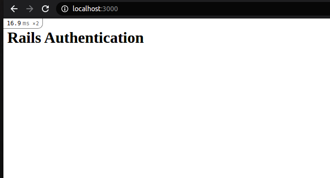
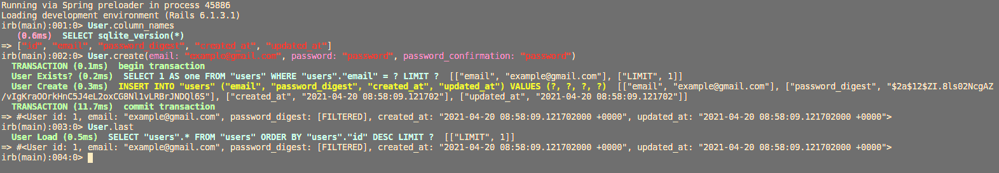
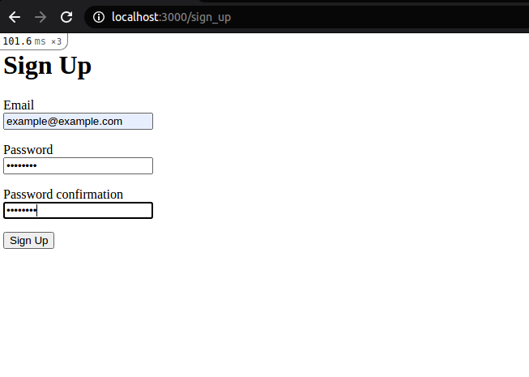
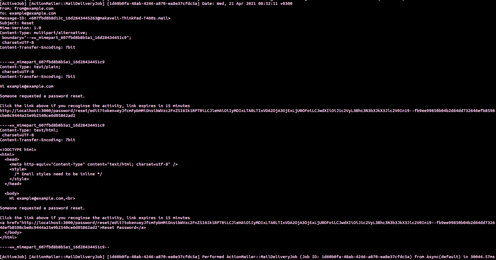
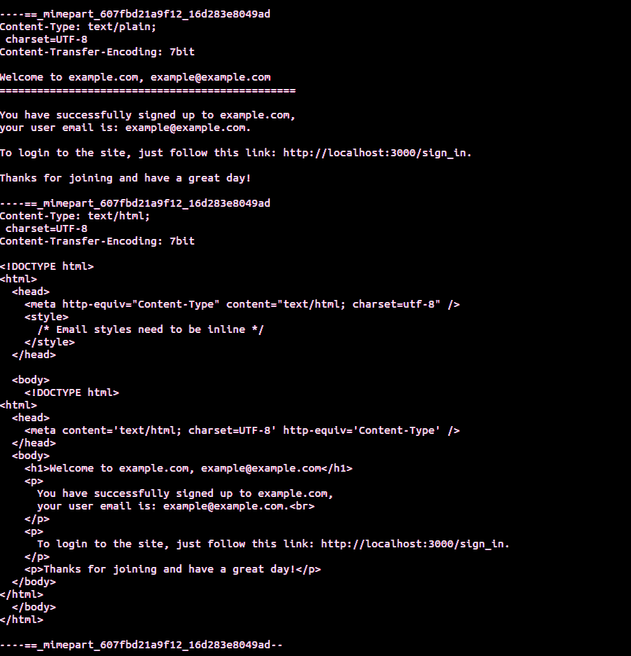

### How to set up User Authentication from Scratch with Rails 6

User Authentication is fundamental in the security of web resources. While setting up user authentication in a `ruby` program, [devise gem](https://rubygems.org/gems/devise) is popular tool. However, at times it can be too big and complicated to customize especially when building a non-complicated application.

### Goal

In this tutorial we will set up user authentication from scratch with Rails 6.

### Prerequisites

To follow along in this article, it is helpful to have:

- The following programs installed on your computer:
  - [Ruby](https://www.ruby-lang.org/en/)
  - [SQLite3](https://www.sqlite.org/)
  - [Node](https://nodejs.org)
  - [yarn](https://classic.yarnpkg.com/en/docs/install)
- [Rails](https://rubygems.org/gems/rails) framework configured.
- Basic working knowledge with Ruby programming language.
- Basic understanding of Object Oriented Programming (OOP) paradigm.
- Text editor installed. Preferrably [vscode](https://code.visualstudio.com/)

### Overview

- [Project Setup](#project-setup)
- [Basic understanding of MVC](#basic-undestanding-of-MVC)
- [Configuring routes](#configuring-routes)
- [Adding Controllers](#adding-controllers)
- [Configuring views](#configuring-views)
- [Password reset](#password-reset)
- [Setting up mailers](#setting-up-mailers)

### Project Setup

To set up the project, follow the following steps:

- Generate a new rails application by running the following command from your terminal:

```bash
rails new auth -T
```

We are using the `-T` argument to exclude `Rails` default testing framework

- Navigate to the newly creted `auth` folder:

```bash
cd auth
```

In the app folder, `Rails` maintains files for the controllers, models, and views.

### Basic understanding of MVC

Model View Controller is a design pattern that divides related programming logic making it easier to reason about.
By convention, rails follow this design pattern.

- We will start by creating our routes. In `config/routes.rb` we add the following:

```rb
Rails.application.routes.draw do
  root 'welcome#index'
end
```

From above we are instructing `Rails` to root to `index` action in `WelcomeController`.

- We will run the following command to create the controller:

```bash
rails generate controller Welcome index --skip-routes
```

`--skip-routes` to mean we have defined the route.

The generator will create files but the most important is the controller file, `app/controllers/welcome_controller.rb`

```rb
class WelcomeController < ApplicationController
  def index
  end
end
```

The generator also created a file in `app/views/welcome/index.html.erb`, by default Rails renders a view that corresponds to the name of a controller action.
Replace the view content with:

```erb
<h1>Rails Authentication</h1>
```

- We have our controller and views in place, let's create the model.

A `model` is a `Ruby` class that hold data, we define it using a generator as follows:

```bash
rails generate model User email:string password_digest:string
```

This will generate several files, we will only focus on..`db/migrate/<timestamp>_create_users.rb` and the `app/models/users.rb`

- Update `db/migrate/<timestamp>_create_users.rb` to:

```rb
class CreateUsers < ActiveRecord::Migration[6.1]
  def change
    create_table :users do |t|
    t.string :email, null: false
    t.string :password_digest

    t.timestamps
  end
end
```

We are adding model level validation to our `email` field.
`password_digest` is used to create password fields in rails and encryption is done by the [bcyrpt_gem](https://rubygems.org/gems/bcrypt). Include the gem in your gemfile.

- Update `app/models/users.rb` to:

```rb
class User < ApplicationRecord
   has_secure_password

   validates :email, presence: true, uniqueness: true, format: { with: /\A[^@\s]+@[^@\s]+\z/, message: 'Invalid email' }
end
```

```bash
gem install bcrypt
```

- Install the gem by running `bundle install`
- Remember to run your migrations [rails_migrations](https://edgeguides.rubyonrails.org/active_record_migrations.html#running-migrations)

```bash
rails db:migrate
```

`has_secure_password` adds methods to set and authenticate [view_page](https://api.rubyonrails.org/classes/ActiveModel/SecurePassword/ClassMethods.html).
The next line adds model level validation, ensures that email is present, unique and conforms to a certain format.

Let's test our app. Fire up the rails app with

```bash
rails server
```

We will see a Rails app with a home page..



- Let's test our model.

```bash
rails console
```

Create a new user



### Configure_routes

- Update `config/routes.rb`

```rb
Rails.application.routes.draw do
  root 'welcome#index'

  get 'sign_up', to: 'registrations#new'
  post 'sign_up', to: 'registrations#create'

  get 'sign_in', to: 'sessions#new'
  post 'sign_in', to: 'sessions#create', as: 'log_in'

  delete 'logout', to: 'sessions#destroy'

  get 'password', to: 'passwords#edit', as: 'edit_password'
  patch 'password', to: 'passwords#update'

  get 'password/reset', to: 'password_resets#new'
  post 'password/reset', to: 'password_resets#create'
  get 'password/reset/edit', to: 'password_resets#edit'
  patch 'password/reset/edit', to: 'password_resets#update'
end
```

We are matching our [routes](https://guides.rubyonrails.org/routing.html) to the above controller and actions.

### Adding Controllers

Routers determine which controller to use for the request, controllers will then receive the request and save or fetch data from our models.

- Let's start with our `registrations` controller. In `app/controllers/registrations_controller.rb` we add the following:

```rb
class RegistrationsController < ApplicationController
  def new
    @user = User.new
  end

  def create
    @user = User.new(user_params)
    if @user.save
      session[:user_id] = @user.id
      redirect_to root_path, notice: 'Successfully created account'
    else
      render :new
    end
  end

  private
  def user_params
    params.require(:user).permit(:email, :password, :password_confirmation)
  end
end
```

From above, we are:

- Instantiating the class User in `app/models/user.rb` in the `new` action.
- Creating the User instance in `create` action and setting it's `id` to `session`.

Note the private method `user_params`, it holds column_names of the `user` model, [permited_params](https://edgeguides.rubyonrails.org/action_controller_overview.html#strong-parameters).
This controller allows us to create a new User.

Let's create `app/controllers/sessions_controller.rb` and add the following contents:

```rb
class SessionsController < ApplicationController
  def new; end

  def create
    user = User.find_by(email: params[:email])
    if user.present? && user.authenticate(params[:password])
      session[:user_id] = user.id
      redirect_to root_path, notice: 'Logged in successfully'
    else
      flash.now[:alert] = 'Invalid email or password'
      render :new
    end
  end

  def destroy
    session[:user_id] = nil
    redirect_to root_path, notice: 'Logged Out'
  end
end
```

When a new user is created, we need to sign in the user. The `create` method finds existing user, checks if user is present and authenticated, refers to database records, if true it logs in the user else throws a flash message `invalid email or password`.
The `delete` action deletes user session when user is `Logged Out`

Let's create `app/controllers/passwords_controller.rb` with the following contents:

```rb
class PasswordsController < ApplicationController
  before_action :require_user_logged_in!

  def edit; end

  def update
    if Current.user.update(password_params)
      redirect_to root_path, notice: 'Password Updated'
    else
      render :edit
    end
  end

  private
  def password_params
    params.require(:user).permit(:password, :password_confirmation)
  end
end
```

There is alot going on in this controller, first the `before_action :require_user_logged_in!` and the `Current` class.
We will get back to this in the tutorial, the controller enables the user to edit and update the password.

In `app/controllers/application_controller.rb` update it to:

```rb
class ApplicationController < ActionController::Base
  before_action :set_current_user

  def set_current_user
    Current.user = User.find_by(id: session[:user_id]) if session[:user_id]
  end

  def require_user_logged_in!
    redirect_to sign_in_path, alert: 'You must be signed in..' if Current.user.nil?
  end
end
```

We define our method `require_user_logged_in!`, this ensures user is logged in before updating the password.
We then have our `Current.user` which find user by session_id and stores it in `set_current_user` method.

- Lets create a new file `app/models/current.rb` with the following contents

```rb
class Current < ActiveSupport::CurrentAttributes
  attribute :user
end
```

This method allows us to call `Current.user` in our views and return the current user.Visit [api_docs](https://api.rubyonrails.org/classes/ActiveSupport/CurrentAttributes.html) for more information.

We now can `sign_up`, `sign_in` and `update_password`, let's update our views.

### Configure views

Controllers makes model data available to the view, this data can then be displayed to the user.

- Let's start by creating the `registrations` views.
  Create a new file `app/views/registrations/new.html.erb` with the above content

```erb
<h1>Sign Up</h1>

<%= form_with model: @user, url: sign_up_path do |f| %>
  <p>
  <%= f.label 'email' %><br>
  <%= f.text_field :email %>
  </p>

  <p>
  <%= f.label 'password' %><br>
  <%= f.password_field :password %>
  </p>

  <p>
  <%= f.label 'password_confirmation' %><br>
  <%= f.password_field :password_confirmation %>
  </p>

  <p>
  <%= f.submit 'Sign Up' %>
  </p>
<% end %>
```

We are creating a form with input fields tied to the user model.
This is a `sign up` form.

- Next, lets create a new file `app/views/sessions/new.html.erb` and add the following

```erb
<h1>Sign In</h1>

<%= form_with url: sign_in_path do |f| %>
  <p>
  <%= f.label 'email:'%><br>
  <%= f.text_field :email, id: 'email' %>
  </p>

  <p>
  <%= f.label 'password:'%><br>
  <%= f.password_field :password, id: 'password' %>
  </p>

  <p>
  <%= f.submit 'Log In' %>
  </p>
<% end %>
```

This is the `sign_in` form.

- Let's add a password update form, create file `app/views/passwords/edit.html.erb` and add the following

```erb
<h1>Edit Password</h1>

<%= form_with model: Current.user, url: edit_password_path do |f| %>
  <p>
  <%= f.label 'password:'%><br>
  <%= f.password_field :password %>
  </p>

  <p>
  <%= f.label 'password_confirmation:'%><br>
  <%= f.password_field :password_confirmation %>
  </p>

  <p>
  <%= f.submit 'Update' %>
  </p>
<% end %>
```

- Let's test our app
  Open `app/views/layouts/application.html.erb` update `<body>` tag to:

```erb
 <body>
   <p class="notice"><%= notice %></p>
   <p class="alert"><%= alert %></p>

   <%= yield %>
 </body>
```

Open `app/views/welcome/index.html.erb` and add ;

```erb
<% if Current.user %>
  Logged in as: <%= Current.user.email %><br>
  <= link_to 'Edit Password', edit_password_path %>
  <%= button_to 'Logout', logout_path, method: :delete %>
  <% else %>
  <%= link_to 'Sign Up', sign_up_path %>
  or
  <%= link_to 'Login', sign_in_path %>
<% end %>
```

- Refresh your app and check to see if you can create a new account, sign_in and edit your password.



### Password reset

We already have our routes in place, we can now update our controllers and views to reset passwords.

- Lets create a file `app/controllers/password_resets_controller.rb` and add the following

```rb
class PasswordResetsController < ApplicationController
  def new; end

  def create
    @user = User.find_by(email: params[:email])

    if @user.present?
      #send mail
      PasswordMailer.with(user: @user).reset.deliver_later
    end
    redirect_to root_path, notice: 'Please check your email to reset the password'
  end

  def edit
    @user = User.find_signed!(params[:token], purpose: 'password_reset')
    rescue ActiveSupport::MessageVerifier::InvalidSignature
      redirect_to sign_in_path, alert: 'Your token has expired. Please try again.'
  end

  def update
    @user = User.find_signed!(params[:token], purpose: 'password_reset')
    if @user.update(password_params)
      redirect_to sign_in_path, notice: 'Your password was reset successfully. Please sign in'
      else
      render :edit
    end

  end

  private
  def password_params
    params.require(:user).permit(:password, :password_confirmation)
  end

end
```

When one requests a reset password, the controller will check to see if email is present, if so sends a reset token with `PasswordMailer` more on mailers later.
In the `edit` action note the use of `find_signed!` provided by rails to set specific token to the user. It takes two arguments `params[:token]` and `purpose`[globalid](https://github.com/rails/globalid).

- Create a new file `app/views/password_resets/edit.html.erb` and add the following

```erb
<h1>Reset your password?</h1>

<%= form_with model: @user, url: password_reset_edit_path(token: params[:token]) do |f| %>
  <p>
  <%= f.label 'password:' %><br />
  <%= f.password_field :password %>
  </p>

  <p>
  <%= f.label 'password_confirmation:' %><br />
  <%= f.password_field :password_confirmation %>
  </p>

  <p>
  <%= f.submit 'Reset Password' %>
  </p>
<% end %>
```

- Create another file `app/views/password_resets/new.html.erb` and add the following

```erb
<h1>Forgot your password?</h1>

<%= form_with url: password_reset_path do |f| %>
  <p>
  <%= f.label 'email:' %><br />
  <%= f.text_field :email %>
  </p>

  <p>
  <%= f.submit 'Reset Password' %>
  </p>
<% end %>
```

### Setting up mailers

Let's start by creating our `PasswordMailer`, feel free and check the docs for more information [mailers](https://edgeguides.rubyonrails.org/action_mailer_basics.html).

- We generate our mailers using the above command

```bash
  rails generate mailer Password reset
```

this will generate several files but the most important in the `app/mailers/password_mailer.rb` and the view files.

- Lets update our `app/mailers/password_mailers.rb` to this:

```rb
class PasswordMailer < ApplicationMailer
  def reset
    @token = params[:user].signed_id(purpose: 'password_reset', expires_in: 15.minutes)

    mail to: params[:user].email
  end
end
```

Our views should look like this
In `app/views/password_mailer/reset.html.erb`

```erb
Hi <%= params[:user].email %>,<br>

Someone requested a password reset.

Click the link above if you recognise the activity, link expires in 15 minutes
<%= link_to 'Reset Password', password_reset_edit_url(token: @token) %>

```

And our `app/views/password_mailer/reset.text.erb`

```erb
Hi <%= params[:user].email %>

Someone requested a password reset.

Click the link above if you recognise the activity, link expires in 15 minutes
<%= password_reset_edit_url(token: @token) %>
```

- Note: in our `app/controllers/password_reset_controller.rb` we have called out mailer class `PasswordMailer.with(user: @user).reset.deliver_later`, the `deliver_later` is part of [Action_job](https://edgeguides.rubyonrails.org/active_job_basics.html) it enables us to que background jobs.
- One more setting before we send our emails, we need to open up our `app/config/environments/development.rb` and add `config.action_mailer.default_url_options = { host: "localhost:3000" }` in the block.

Phew, we are almost done with the application. Last lap,now that we are in the `app/config/environments/development.rb` let's set up to use gmail [Configuration_for_gmail](https://edgeguides.rubyonrails.org/action_mailer_basics.html#action-mailer-configuration-for-gmail).
Add the following in the block

```rb
config.action_mailer.delivery_method = :smtp
  config.action_mailer.smtp_settings = {
    user_name:      ENV['email'],
    password:       ENV['password'],
    domain:         ENV['localhost:3000'],
    address:       'smtp.gmail.com',
    port:          '587',
    authentication: :plain,
    enable_starttls_auto: true
  }
```

Change the `email` and `password` to match your credentials and restart your server.

- Now let's create our welcome mailer

```bash
  rails generate mailer Welcome
```

Update the `app/mailers/welcome_mailer.rb` to

```rb
class WelcomeMailer < ApplicationMailer
  def welcome_email
    @user = params[:user]
    @url = 'http://localhost:3000/sign_in'
    mail(to: @user.email, subject: 'Welcome to my awesome tutorial')
  end
end
```

Update your mailer views in `app/views/welcome_mailer/welcome_email.html.erb` to:

```erb
<!DOCTYPE html>
<html>
  <head>
    <meta content='text/html; charset=UTF-8' http-equiv='Content-Type' />
  </head>
  <body>
    <h1>Welcome to example.com, <%= @user.email %></h1>
    <p>
      You have successfully signed up to example.com,
      your user email is: <%= @user.email %>.<br>
    </p>
    <p>
      To login to the site, just follow this link: <%= @url %>.
    </p>
    <p>Thanks for joining and have a great day!</p>
  </body>
</html>
```

And our `app/views/welcome_mailer/welcome_email.text.erb` to

```erb
Welcome to example.com, <%= @user.email %>
===============================================

You have successfully signed up to example.com,
your user email is: <%= @user.email %>.

To login to the site, just follow this link: <%= @url %>.

Thanks for joining and have a great day!
```

- Remember to add a link in `app/views/sessions/new.html.erb` to reset your passwords, update the file to match the above.

```erb
<h1>Sign In</h1>

<%= form_with url: sign_in_path do |f| %>
  <p>
  <%= f.label 'email:'%><br>
  <%= f.text_field :email, id: 'email' %>
  </p>

  <p>
  <%= f.label 'password:'%><br>
  <%= f.password_field :password, id: 'password' %><br>
  <%= link_to 'Forgot your password?', password_reset_path %>
  </p>

  <p>
  <%= f.submit 'Log In' %>
  </p>
<% end %>
```



- To send the Welcome email, we will have to update our `create` action in `app/controllers/registrations_controller.rb` to ...

```rb
def create
  @user = User.new(user_params)
  if @user.save
    WelcomeMailer.with(user: @user).welcome_email.deliver_now
    session[:user_id] = @user.id
    redirect_to root_path, notice: 'Successfully created account'
  else
    render :new
  end
end
```



### Summary

In this article, we have implemented a complete Rails authentication system.

The finalized code can be accessed from [here](https://github.com/Njunu-sk/Rails-Authentication). Feel free to give the project a star.

### Conclusion

Many applications need User Authentication, allowing only registered users to be able to access the application. It is essential to have a robust authentication system to protect your web application.

Check out the following resources for further clarifications:

- [Go_Rails](https://gorails.com/)
- [Rails_edge_guides](https://edgeguides.rubyonrails.org)
- [Code_project](https://www.codeproject.com/articles/575551/user-authentication-in-ruby-on-rails)

You can always reach out via [Twitter](https://twitter.com/njunusimon)

Happy coding!!
